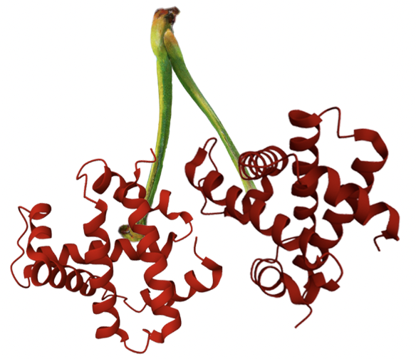

<!-- <div style="display: flex; align-items: center;">
    
    <h1 style="margin-left: 10px;">CherryML: Scalable Maximum Likelihood Estimation of Phylogenetic Models</h1>
</div> -->

# CherryML: Scalable Maximum Likelihood Estimation of Phylogenetic Models (including SiteRM and FastCherries)


This package implements the methods - and allows easily reproducing the results - from our papers:

> Prillo, S., Deng, Y., Boyeau, P., Li, X., Chen, P.-Y., Song, Y.S.  (2023) CherryML: Scalable maximum likelihood estimation of phylogenetic models. Nature Methods.

> Prillo, S., Wu, W., Song, Y.S.  (2024) Ultrafast classical phylogenetic method beats large protein language models on variant effect prediction. NeurIPS.

Firstly, as relates to our paper `CherryML: Scalable maximum likelihood estimation of phylogenetic models`, this package implements the CherryML method as applied to:
1. The classical LG model of amino acid evolution with site rate variation [Le and Gascuel 2008] (involving a $20 \times 20$ rate matrix), as well as
2. A model of co-evolution at protein contact sites (involving a $400 \times 400$ rate matrix).

Note that (1) is NOT the LG rate matrix but the LG _model_; the LG rate matrix [Le and Gascuel 2008] was estimated under the LG model using a specific dataset (a version of Pfam from 2008).

For a quick demonstration of an end-to-end application of CherryML and FastCherries to real data, please check out the section "[End-to-end worked-out application: plant dataset](#end-to-end-worked-out-application-plant-dataset)".

You can find the full API for CherryML in the section "[CherryML full API](#cherryml-full-api)".

To reproduce all the figures from our Nature Methods 2023 paper, see the section "[Reproducing all figures in our paper CherryML: scalable maximum likelihood estimation of phylogenetic models](#reproducing-all-figures-in-our-paper-cherryml-scalable-maximum-likelihood-estimation-of-phylogenetic-models)".

Secondly, as relates to our paper `Ultrafast classical phylogenetic method beats large protein language models on variant effect prediction`, this package implements the FastCherries phylogeny estimator and the SiteRM model:
- FastCherries is a drop-in replacement for FastTree which speeds up the tree estimation step of CherryML by 10-100x.
- SiteRM is an extension of the LG model that allows for a *different* rate matrix for each site of the MSA.

We provide a Python API for SiteRM/FastCherries; please refer to the section "[SiteRM/FastCherries: Python API](#sitermfastcherries-python-api)".

To reproduce all the figures from our NeurIPS 2024 paper, see the section "[Reproducing all figures in our paper Ultrafast classical phylogenetic method beats large protein language models on variant effect prediction (a.k.a. SiteRM/FastCherries paper)](#reproducing-all-figures-in-our-paper-ultrafast-classical-phylogenetic-method-beats-large-protein-language-models-on-variant-effect-prediction-aka-sitermfastcherries-paper)".

# Citation

If you use `cherryml` in your work, please cite:

> Prillo, S., Deng, Y., Boyeau, P., Li, X., Chen, P.-Y., Song, Y.S.  (2023) CherryML: Scalable maximum likelihood estimation of phylogenetic models. Nature Methods, in press.

If you use the SiteRM model or FastCherries, please cite:

> Prillo, S., Wu, W., Song, Y.S.  (2024) Ultrafast classical phylogenetic method beats large protein language models on variant effect prediction. NeurIPS.

# Installation

## For users

CherryML is on PyPI, so you can install is simply with:

```
pip install cherryml
```

## For developers

Create a Python environment:

```
conda create --name cherryml-dev python=3.10
conda activate cherryml-dev
```

Make sure to install `cython` first:

```
pip install cython
```

Install all required Python libraries:

```
pip install -r requirements.txt
```

Build cython modules:

```
python setup.py build_ext --inplace
```

Run all tests:

```
python -m pytest tests/ --runslow
```

# Demo: CherryML applied to the LG model (runtime on a normal computer: 1 - 5 minutes)

The following command learns a rate matrix from a set of MSAs, trees, and site rates (try it out!). Later we explain how to use CherryML when you only have MSAs (i.e. no trees):

```
python -m cherryml \
    --output_path learned_rate_matrix_LG.txt \
    --model_name LG \
    --msa_dir demo_data/msas \
    --tree_dir demo_data/trees \
    --site_rates_dir demo_data/site_rates \
    --cache_dir _cache_demo
```

Expected output: `learned_rate_matrix_LG.txt` contains the learned rate matrix.

Generally, the learned rate matrix is written to the `output_path`, in this case `learned_rate_matrix_LG.txt`. The directories `msa_dir`, `tree_dir`, `site_rates_dir` should contain one file per family, named `[family_name].txt`, where `[family_name]` is the name of the family. Check out the contents of the directories in `demo_data/` for an example; this demo data is based on real data obtained from Pfam. The format of the files in these directories should be as follows:

Each file in `msa_dir` should list the protein sequences in a family following the format in the following toy example:
```
>seq1
TTLLS
>seq2
TTIIS
>seq3
SSIIS
```
All sequences should have the same length.

Each file in `tree_dir` should list the tree for a family following the format in the following toy example:
```
6 nodes
internal-0
internal-1
internal-2
seq1
seq2
seq3
5 edges
internal-0 internal-1 1.0
internal-1 internal-2 2.0
internal-2 seq1 3.0
internal-2 seq2 4.0
internal-1 seq3 5.0
```
This format is intended to be easier to parse than the newick format. It first lists the nodes in the tree, and then the edges in the tree with their lengths.

Each file in `site_rates_dir` should list the site rates for a family following the format in the following toy example:
```
5 sites
1.0 0.8 1.2 0.7 1.05
```

The `cache_dir` is used to store intermediate computations for future runs. Caching is transparent to the user; just make sure to use a different `cache_dir` for different datasets. If not provided, a temporary directory will be used as the caching directory (in which case all intermediate data will be lost).

If you have _not_ estimated trees and site rates already, CherryML will do that for you using either FastTree or FastCherries. You can simply omit the `tree_dir` and `site_rates_dir` arguments and run. FastTree is used by default for backwards compatibility reasons. To use FastCherries - which is substantially faster - add `--tree_estimator FastCherries` to the command below:

```
python -m cherryml \
    --output_path learned_rate_matrix_LG.txt \
    --model_name LG \
    --msa_dir demo_data/msas \
    --cache_dir _cache_demo \
    --num_processes_tree_estimation 32
```

Expected output: `learned_rate_matrix_LG.txt` contains the learned rate matrix.

FastTree will by default be run with 20 rate categories and with the LG rate matrix (this can be changed by using the full API described later). The trees estimated with FastTree will be saved in the `cache_dir`, and will be re-used by CherryML if they are needed in future runs with the same data (for example when learning a rate matrix on a subset of families, as done via the `--families` argument, or when learning a rate matrix on a subset of sites, as done via the `--sites_subset_dir` argument; clearly trees do not need to be re-estimated in this case!). The argument `--num_processes_tree_estimation` is used to parallelize tree estimation. In the example above, 32 processes are used. In our more recent work at NeurIPS 2024, we introduce FastCherries, which is 10-100x faster than FastTree. You can use it by adding the argument `--tree_estimator FastCherries`. Note that FastCherries only estimates the cherries in the tree, so the returned tree will be a star-type tree with all the inferred cherries hanging from the root. (FastCherries does also estimate the site rates.)

To learn a rate matrix on only a subset of sites from each family (for example, when learning a domain-specific or structure-specific rate matrix), you can provide the indices of the sites used for each family with the `--sites_subset_dir` argument. Each file in `sites_subset_dir` should list the sites (0-based) for a family following the format in the following toy example:
```
3 sites
0 1 4
```

The CherryML API provides control over many aspects of the rate estimation process, such as the number of processes used to parallelize tree estimation, the number of rounds used to iterate between tree estimation and rate estimation, among others. These options are all described below or by running `python -m cherryml --help`.

# Demo: CherryML applied to the co-evolution model (runtime on a normal computer: 1 - 5 minutes)

To learn a coevolution model, you just need to set `--model_name co-evolution` and provide the directory with the contact maps:

```
python -m cherryml \
    --output_path learned_rate_matrix_co-evolution.txt \
    --model_name co-evolution \
    --msa_dir demo_data/msas \
    --contact_map_dir demo_data/contact_maps \
    --tree_dir demo_data/trees \
    --site_rates_dir demo_data/site_rates \
    --cache_dir _cache_demo \
    --num_epochs 10
```

We use 10 epochs in this demo so that it runs faster, but in practice we use 500 epochs. The speed of training will depend on the computer architecture.

Expected output: `learned_rate_matrix_co-evolution.txt` contains the learned rate matrix.

Each file in `contact_map_dir` should list the contact map for a family following the format in the following toy example:
```
5 sites
10101
01110
11110
01111
10011
```

As before, if you have not estimated trees already, you can omit the `tree_dir` and CherryML will estimate these for you. (In this case, we recommend using `--num_rate_categories 1` since the coevolution model does not model site rate variation.)

# CherryML Full API

The CherryML API provides extensive functionality through additional flags, which we describe below (this is shown when running `python -m cherryml --help`):

```
  -h, --help            show this help message and exit
  --output_path OUTPUT_PATH
                        Filepath where to write the learned rate matrix (default:
                        None)
  --model_name MODEL_NAME
                        Either "LG" or "co-evolution". If "LG", a 20x20 rate
                        matrix will be learned. If "co-evolution", a 400x400 rate
                        matrix will be learned. (default: None)
  --msa_dir MSA_DIR     Directory where the training multiple sequence alignments
                        (MSAs) are stored. See README at
                        https://github.com/songlab-cal/CherryML for the expected
                        format of these files. (default: None)
  --contact_map_dir CONTACT_MAP_DIR
                        Directory where the contact maps are stored. See README
                        at https://github.com/songlab-cal/CherryML for the
                        expected format of these files. (default: None)
  --tree_dir TREE_DIR   Directory where the trees are stored. See README at
                        https://github.com/songlab-cal/CherryML for the expected
                        format of these files. If not provided, trees will be
                        estimated with FastTree. (default: None)
  --site_rates_dir SITE_RATES_DIR
                        Directory where the site rates are stored. See README at
                        https://github.com/songlab-cal/CherryML for the expected
                        format of these files. If not provided, site rates will
                        be estimated with FastTree. (default: None)
  --cache_dir CACHE_DIR
                        Directory to use to cache intermediate computations for
                        re-use in future runs of cherryml. Use a different cache
                        directory for different input datasets. If not provided,
                        a temporary directory will be used. (default: None)
  --num_processes_tree_estimation NUM_PROCESSES_TREE_ESTIMATION
                        Number of processes to parallelize tree estimation (with
                        FastTree). (default: 32)
  --num_processes_counting NUM_PROCESSES_COUNTING
                        Number of processes to parallelize counting transitions.
                        (default: 1)
  --num_processes_optimization NUM_PROCESSES_OPTIMIZATION
                        Number of processes to parallelize optimization (if using
                        cpu). (default: 1)
  --num_rate_categories NUM_RATE_CATEGORIES
                        Number of rate categories to use in FastTree to estimate
                        trees and site rates (if trees are not provided).
                        (default: 20)
  --initial_tree_estimator_rate_matrix_path INITIAL_TREE_ESTIMATOR_RATE_MATRIX_PATH
                        Rate matrix to use in FastTree to estimate trees and site
                        rates (the first time around, and only if trees and site
                        rates are not provided) (default:
                        data/rate_matrices/lg.txt)
  --num_iterations NUM_ITERATIONS
                        Number of times to iterate tree estimation and rate
                        matrix estimation. For highly accurate rate matrix
                        estimation this is a good idea, although tree
                        reconstruction becomes the bottleneck. (default: 1)
  --quantization_grid_center QUANTIZATION_GRID_CENTER
                        The center value used for time quantization. (default:
                        0.03)
  --quantization_grid_step QUANTIZATION_GRID_STEP
                        The geometric spacing between time quantization points.
                        (default: 1.1)
  --quantization_grid_num_steps QUANTIZATION_GRID_NUM_STEPS
                        The number of quantization points to the left and right
                        of the center. (default: 64)
  --use_cpp_counting_implementation USE_CPP_COUNTING_IMPLEMENTATION
                        Whether to use C++ MPI implementation to count
                        transitions ('True' or 'False'). This requires mpirun to
                        be installed. If you do not have mpirun installed, set
                        this argument to False to use a Python implementation
                        (but it will be much slower). (default: True)
  --optimizer_device OPTIMIZER_DEVICE
                        Either "cpu" or "cuda". Device to use in PyTorch. "cpu"
                        is fast enough for applications, but if you have a GPU
                        using "cuda" might provide faster runtime. (default: cpu)
  --learning_rate LEARNING_RATE
                        The learning rate in the PyTorch optimizer. (default:
                        0.1)
  --num_epochs NUM_EPOCHS
                        The number of epochs of the PyTorch optimizer. (default:
                        500)
  --minimum_distance_for_nontrivial_contact MINIMUM_DISTANCE_FOR_NONTRIVIAL_CONTACT
                        Minimum distance in primary structure used to determine
                        if two site are in non-trivial contact. (default: 7)
  --families [FAMILIES [FAMILIES ...]]
                        Subset of families on which to run rate matrix
                        estimation. If not provided, all families in the
                        `msa_dir` will be used. (default: None)
  --sites_subset_dir SITES_SUBSET_DIR
                        Directory where the subset of sites from each family used
                        to learn the rate matrix are specified. Currently only
                        implemented for the LG model. This enables learning e.g.
                        domain-specific or structure-specific rate matrices. See
                        README at https://github.com/songlab-cal/CherryML for the
                        expected format of these files. (default: None)
  --tree_estimator_name TREE_ESTIMATOR_NAME
                        Tree estimator to use. Can be either 'FastTree' or
                        'PhyML' or 'FastCherries'. ('FastCherries' is incredibly
                        fast!) (default: FastTree)
  --cherryml_type CHERRYML_TYPE
                        Whether to use 'cherry' or 'cherry++'. Here, 'cherry'
                        uses just the cherries in the trees, whereas
                        'cherry++' iteratively picks cherries until at most
                        one unpaired sequence remains. Thus, 'cherry++' uses
                        more of the available data. Empirically, 'cherry++'
                        shows increased statistical efficiency at essentially
                        no runtime cost. (default: cherry++)
```

# Evaluation API

For the purpose of model selection, we have exposed a simple API enabling the evaluation of a rate matrix's fit to a set of MSAs. This API is a simple wrapper around the FastTree and PhyML programs. For example, to compute the fit of the LG rate matrix to the 3 MSAs under `tests/evaluation_tests/a3m_small`, you can simply run:

```
python -m cherryml.evaluation \
    --msa_dir tests/evaluation_tests/a3m_small \
    --rate_matrix_path data/rate_matrices/lg.txt \
    --num_rate_categories 4 \
    --output_path log_likelihoods.txt \
    --cache_dir _cache_demo \
    --num_processes_tree_estimation 3 \
    --tree_estimator_name FastTree
```

The output - written to the file `log_likelihoods.txt` - looks like this:

```
Total log-likelihood: -700.1151
Total number of sites: 48
Average log-likelihood per site: -14.58573125
Families: 1e7l_1_A 5a0l_1_A 6anz_1_B
Log-likelihood per family: -198.2552 -216.9863 -284.8736
Sites per family: 16 16 16
```

The first line indicates the total log-likelihood (over all families). The second line indicates the total number of sites across all the provided MSAs. The third line shows the average log-likelihood per site (which is the ratio of the two previous quantities). The fourth line lists the families which were used to compute the log-likelihood. Next, the log-likelihood for each family is shown. Finally, the number of sites in each family is shown. Note that the total log-likelihood is equal to the sum of the log-likelihoods of each family.

Note that by default, FastTree computes log-likelihoods under MLE rates. To compute log-likelihoods under a Gamma model, provide this option through the `--extra_command_line_args` argument. Thus, to compute Gamma log-likelihoods, you can use:

```
python -m cherryml.evaluation \
    --msa_dir tests/evaluation_tests/a3m_small \
    --rate_matrix_path data/rate_matrices/lg.txt \
    --num_rate_categories 4 \
    --output_path log_likelihoods.txt \
    --cache_dir _cache_demo \
    --num_processes_tree_estimation 3 \
    --tree_estimator_name FastTree \
    --extra_command_line_args='-gamma'
```

In this case, the output is:

```
Total log-likelihood: -723.442
Total number of sites: 48
Average log-likelihood per site: -15.071708333333333
Families: 1e7l_1_A 5a0l_1_A 6anz_1_B
Log-likelihood per family: -205.047 -225.683 -292.712
Sites per family: 16 16 16
```

As you can see, log-likelihoods are lower under the Gamma model because this model accounts for the possibility that the site rates could have been something else other than the MLE rates.

We can also use PhyML instead of FastTree. PhyML computes likelihoods under a Gamma model by default. Generally, PhyML is slower than FastTree but more precise:

```
python -m cherryml.evaluation \
    --msa_dir tests/evaluation_tests/a3m_small \
    --rate_matrix_path data/rate_matrices/lg.txt \
    --num_rate_categories 4 \
    --output_path log_likelihoods.txt \
    --cache_dir _cache_demo \
    --num_processes_tree_estimation 3 \
    --tree_estimator_name PhyML
```

The output is:

```
Total log-likelihood: -717.50699
Total number of sites: 48
Average log-likelihood per site: -14.948062291666666
Families: 1e7l_1_A 5a0l_1_A 6anz_1_B
Log-likelihood per family: -204.41537 -223.26711 -289.82451
Sites per family: 16 16 16
```

You will note that PhyML obtained a better Gamma log-likelihood than FastTree. Unless over-ridden by the user with `--extra_command_line_args`, PhyML is being run with the extra command line arguments `--datatype aa --pinv e --r_seed 0 --bootstrap 0 -f m --alpha e --print_site_lnl`.

# Full API

The command line tool can be invoked with `python -m cherryml.evaluation` and accepts the following arguments:

```
  -h, --help            show this help message and exit
  --output_path OUTPUT_PATH
                        Filepath where to write the log-likelihood (default:
                        None)
  --rate_matrix_path RATE_MATRIX_PATH
                        Filepath where the rate matrix to evaluate is stored.
                        (default: None)
  --msa_dir MSA_DIR     Directory where the multiple sequence alignments
                        (MSAs) are stored. See README at
                        https://github.com/songlab-cal/CherryML for the
                        expected format of these files. (default: None)
  --cache_dir CACHE_DIR
                        Directory to use to cache intermediate computations
                        for re-use in future runs of cherryml. Use a different
                        cache directory for different input datasets. If not
                        provided, a temporary directory will be used.
                        (default: None)
  --num_processes_tree_estimation NUM_PROCESSES_TREE_ESTIMATION
                        Number of processes to parallelize tree estimation.
                        (default: 32)
  --num_rate_categories NUM_RATE_CATEGORIES
                        Number of rate categories to use in the tree estimator
                        to estimate trees and site rates. (default: 20)
  --families [FAMILIES [FAMILIES ...]]
                        Subset of families for which to evaluate log
                        likelihood. If not provided, all families in the
                        `msa_dir` will be used. (default: None)
  --tree_estimator_name TREE_ESTIMATOR_NAME
                        Tree estimator to use. Can be either 'FastTree' or
                        'PhyML'. (default: FastTree)
  --extra_command_line_args EXTRA_COMMAND_LINE_ARGS
                        Extra command line arguments for the tree estimator,
                        e.g. `-gamma` for FastTree to compute Gamma
                        likelihoods. (default: None)
```

# SiteRM/FastCherries: Python API

You can train the SiteRM model (or just run FastCherries) with the function `learn_site_specific_rate_matrices`. You can import it with `from cherryml import learn_site_specific_rate_matrices`. The API is described below (if you just want to run FastCherries, use `just_run_fast_cherries=True`):

```
def learn_site_specific_rate_matrices(
    tree: Optional[cherryml_io.Tree],
    msa: Dict[str, str],
    alphabet: List[str],
    regularization_rate_matrix: pd.DataFrame,
    regularization_strength: float = 0.5,
    device: str = "cpu",
    num_rate_categories: int = 20,
    alphabet_for_site_rate_estimation: Optional[List[str]] = None,
    rate_matrix_for_site_rate_estimation: Optional[pd.DataFrame] = None,
    num_epochs: int = 100,
    quantization_grid_num_steps: int = 64,
    use_vectorized_implementation: bool = True,
    just_run_fast_cherries: bool = False,
) -> Dict:
    """
    Learn a rate matrix per site given an MSA (and optionally a tree).

    This function implements learning under the SiteRM model. Briefly, the
    SiteRM model uses a different rate matrix per site. It is described in
    detail in our paper:

    ```
    Prillo, S., Wu, W., Song, Y.S.  (NeurIPS 2024) Ultrafast classical
    phylogenetic method beats large protein language models on variant
    effect prediction.
    ```

    We offer two different implementation of SiteRM training, a "vectorized"
    version an a "non-vectorized" version. The default implementation is the
    vectorized one. Briefly, in the vectorized implementation a single
    computational graph is built encompassing all sites in the MSA, with the
    loss (i.e. the data log-likelihood) being the sum over all sites. This
    implementation uses 4D tensors to batch all the sites together, and is
    great when used in combination with `device="cuda"`. In other words, the
    vectorized implementation is recommended when GPU is available. When only
    CPU is available, we provide an alternative implementation where we simply
    loop over all sites in the MSA, one at a time. This implementation solves
    one optimization problem per site in the MSA, and involves only 3D tensors.
    This non-vectorized implementation makes sense if RAM memory becomes
    a bottleneck (e.g. if working on a personal computer).

    Args:
        tree: If `None`, then FastCherries will be used to estimate the tree.
            Otherwise, you can provide your own tree, which should be of
            the CherryML Tree type.
            NOTE: You can easily convert a newick tree to the CherryML Tree
            type using:
            ```
            from cherryml.io import convert_newick_to_CherryML_Tree
            tree = convert_newick_to_CherryML_Tree(tree_newick)
            ```
            Alternatively, if you have a file containing a tree in the CherryML
            format, you can just do:
            ```
            from cherryml.io import read_tree
            tree = read_tree(tree_path)
            ```
        msa: Dictionary mapping each leaf in the tree to the states (e.g.
            protein or DNA sequence) for that leaf.
        alphabet: List of valid states, e.g. ["A", "C", "G", "T"] for DNA.
        regularization_rate_matrix: Rate matrix to use to regularize the learnt
            rate matrices.
        regularization_strength: Between 0 and 1. 0 means no regularization at
            all, and 1 means fully regularized model. This is lambda in our
            paper.
        device: Whether to use "cpu" or GPU ("cuda"). Note that this is only
            used for the vectorized implementation, i.e. if
            `use_vectorized_implementation=False` then only CPU will be used,
            as it doesn't really make sense to use GPU in this case.
        num_rate_categories: Number of rate categories to use.
        alphabet_for_site_rate_estimation: Alphabet for learning the SITE RATES.
            If `None`, then the alphabet for the learnt rate matrices, i.e.
            `alphabet`, will be used. In our FastCherries/SiteRM paper, we have
            observed that for ProteinGym variant effect prediction, it works
            best to *exclude* gaps while estimating site rates (as is standard
            in statistical phylogenetics), but then use gaps when learning the
            rate matrix at the site. In that case, one would use
            `alphabet_for_site_rate_estimation=["A", "C", "G", "T"]`
            together with `alphabet=["A", "C", "G", "T", "-"]`.
        rate_matrix_for_site_rate_estimation: If provided, the rate matrix to
            use to estimate site rates. If `None`, then the
            `regularization_rate_matrix` will be used.
        num_epochs: Number of epochs (Adam steps) in the PyTorch optimizer.
        quantization_grid_num_steps: Number of quantization points to use will
            be `2 * quantization_grid_num_steps + 1` (as we take this number of
            steps left and right of the grid center). Lowering
            `quantization_grid_num_steps` leads to faster training at the
            expense of some accuracy. By default,
            `quantization_grid_num_steps=64` works really well, but great
            estimates can still be obtained faster with as low as
            `quantization_grid_num_steps=8`.
        use_vectorized_implementation: When `True`, a single computational
            graph including all sites of the MSA will be constructed to learn
            the site-specific rate matrices. Otherwise, the algorithm will loop
            over each site in the MSA separately, running coordinate ascent
            once for each site. As a note, while the vectorized and
            non-vectorized implementation converge to the same solution, they
            don't converge with the same trajectories, so when using a smaller
            number of `num_epochs` (e.g. `num_epochs=30`) the learnt rate
            matrices may differ in non-trivial ways. However, when using a
            larger number of epochs, e.g. `num_epochs=200`, they should be
            very similar. The main reason to use the non-vectorized
            implementation is because it requires less RAM memory, as each
            site it processes separately, making it faster when RAM is limited.
        just_run_fast_cherries: If `True`, then only the trees estimated with
            FastCherries will be returned, i.e. we will skip SiteRM. This is
            useful if all you need are the cherries and site rates of
            FastCherries. Recall that FastCherries only estimates the cherries
            in the tree, so the returned tree will be a star-type tree with all
            the inferred cherries hanging from the root. `learnt_rate_matrices`
            will be None in this case.

    Returns:
        A dictionary with the following entries:
            - "learnt_rate_matrices": A 3D numpy array with the learnt rate
                matrix per site.
            - "learnt_site_rates": A List[float] with the learnt site rate per
                site.
            - "learnt_tree": The FastCherries learnt tree (or the provided tree
                if it was provided). It is of type cherryml_io.Tree. Note that
                FastCherries only estimates the cherries in the tree and
                therefore returns a star-type tree with all the inferred
                cherries hanging from the root. Such as tree might look like
                this in newick format:
                "((leaf_1:0.17,leaf_2:0.17)internal-0:1,(leaf_3:0.17,leaf_4:0.17)internal-1:1);"
            - "time_...": The time taken by this substep. (They should add up
                to the total runtime, up to a small rather negligible
                difference).
    """
```

# End-to-end worked-out application: plant dataset

Here we show a concrete example of how to use CherryML to estimate a rate matrix de-novo - which is more useful than LG for this dataset - just starting from MSAs. For this, we will use the plant dataset from Ran et al. (2018), `Phylogenomics resolves the deep phylogeny of seed plants and indicates partial convergent or homoplastic evolution between Gnetales and angiosperms`, with the train-test splits in the QMaker paper. The training MSAs are already located at `demo_data/plant_train` in this repository and the testing MSAs are located at `demo_data/plant_test`. (So, you do not need to download anything!) We start by fitting the LG model using the FastTree tree estimator and the CherryML rate matrix optimizer. We start from the LG rate matrix and perform two rounds of alternating rate matrix and tree optimization (which is usually enough for convergence when adjusting the LG rate matrix to a new dataset). We will use 4 CPU cores in this example, as when running on a personal computer:

```
time python -m cherryml \
    --output_path plant_CherryML.txt \
    --model_name LG \
    --msa_dir demo_data/plant_train \
    --cache_dir _cache_plant \
    --num_processes_tree_estimation 4 \
    --num_processes_counting 4 \
    --num_processes_optimization 2 \
    --num_rate_categories 4 \
    --initial_tree_estimator_rate_matrix_path data/rate_matrices/lg.txt \
    --num_iterations 2 \
    --tree_estimator_name FastTree
```

<!-- ```
real	21m55.722s
user	79m8.700s
sys	1m52.647s
``` -->

End-to-end rate matrix estimation took 22 minutes wall-clock time on a MacBook Pro with the following specs:

```
Processor: 2.6 GHz 6-Core Intel Core i7
Memory: 16 GB 2400 MHz DDR4
```

In our NeurIPS 2024 paper, we introduce FastCherries. Using FastCherries, end-to-end rate matrix estimation took under 1 minute instead! To use FastCherries, use `--tree_estimator_name FastCherries` instead. Try it out!

Now we proceed to evaluate model fit on held-out data. The testing MSAs are located at `demo_data/plant_test`. Thus:

```
time python -m cherryml.evaluation \
    --msa_dir demo_data/plant_test \
    --rate_matrix_path plant_CherryML.txt \
    --num_rate_categories 4 \
    --output_path log_likelihoods_plant_CherryML.txt \
    --cache_dir _cache_plant \
    --num_processes_tree_estimation 4 \
    --tree_estimator_name FastTree
```

<!-- ```
real	3m1.096s
user	10m45.304s
sys	0m17.869s
``` -->

Evaluation took 3 minutes wall-clock time on the same computer. The output is:

```
Total log-likelihood: -2042731.0602000006
Total number of sites: 101064
Average log-likelihood per site: -20.21225223818571
[...]
```

For the rate matrix estimated with FastCherries in under a minute, we have almost identical performance:

```
Total log-likelihood: -2042833.0975
Total number of sites: 101064
Average log-likelihood per site: -20.213261868716852
[...]
```

Finally, we compute the model fit of the LG rate matrix:

```
time python -m cherryml.evaluation \
    --msa_dir demo_data/plant_test \
    --rate_matrix_path data/rate_matrices/lg.txt \
    --num_rate_categories 4 \
    --output_path log_likelihoods_plant_LG.txt \
    --cache_dir _cache_plant \
    --num_processes_tree_estimation 4 \
    --tree_estimator_name FastTree
```

<!-- ```
real	3m41.567s
user	13m19.375s
sys	0m20.158s
``` -->

Evaluation took 4 minutes wall-clock time. The output is:

```
Total log-likelihood: -2072516.731100001
Total number of sites: 101064
Average log-likelihood per site: -20.50697311703476
[...]
```

As we can see, the de-novo estimated rate matrix (with either FastTree or FastCherries) outperforms the LG rate matrix, with an average increase in log-likelihood per site of `0.295` (1.4%).

# Reproducing all figures in our paper `CherryML: scalable maximum likelihood estimation of phylogenetic models`.

To reproduce all figures in our paper, proceed as described below. Please note that this will not work in the compute capsule associated with this work since memory and compute are limited in the capsule. To reproduce all figures, you will need a machine with 32 CPU cores and 150G of storage; the Pfam dataset is large and we are in the realm of high-performance computing, which is out of reach with a compute capsule.

## Demo: Reproducing a simplified version of Figure 1e (runtime on a normal computer: ~10 minutes)

Nonetheless, in the compute capsule we reproduce a simplified version of Fig. 1e, using FastTree instead of PhyML to evaluate likelihoods - and excluding EM since it is very slow (takes ~12 hours to train) - as follows:

```
time python reproduce_fig_1e_simplified_demo.py
```

Expected output: `fig_1e_simplified/` contains the reproduced version of Fig. 1e (without EM).

FastTree is faster, which is better for the demo, and the results are similar. Reproducing Fig. 1e (excluding EM) with FastTree takes ~10 minutes. Using PhyML (as in `reproduce_all_figures.py`, and as in our paper), would take ~4 hours. Note that if you have less than 32 cores available, you should change `num_processes=32` to a different value in `reproduce_fig_1e_simplified_demo.py`. In this case, it will take longer than ~10 minutes. In our more recent work at NeurIPS 2024, we introduce FastCherries, which is 10-100x faster than FastTree!

## System requirements

CherryML has been tested on an Ubuntu system (20.04) with Python (3.10).

The following are system requirements:

```
autoconf
automake
gcc
libboost-dev
libboost-regex-dev
libgsl-dev
libopenmpi-dev
mpich
pkg-config
wget
zlib1g-dev
```

All third-party software, including FastTree [Price et al. 2010] (`FastTree` program), PhyML [Guindon et al. 2010] (`phyml` program), and XRATE [Klosterman et al. 2006] (`xrate` program), will be automatically installed locally into this repository by our code if you have not installed it already on your system. If you would like to install these third-party tools on your system, you can do e.g.:

To install FastTree (again, this is optional, we will install FastTree locally otherwise):
```
mkdir -p /opt/FastTree/bin/
mkdir -p /opt/FastTree/download/
export PATH=/opt/FastTree/bin:$PATH
wget http://www.microbesonline.org/fasttree/FastTree.c -P /opt/FastTree/download/
gcc -DNO_SSE -DUSE_DOUBLE -O3 -finline-functions -funroll-loops -Wall \
    -o /opt/FastTree/bin/FastTree /opt/FastTree/download/FastTree.c -lm
```

To install PhyML (again, this is optional, we will install PhyML locally otherwise):
```
mkdir -p /opt/phyml/bin/
mkdir -p /opt/phyml/download/
export PATH=/opt/phyml/bin:$PATH
git clone https://github.com/stephaneguindon/phyml /opt/phyml/download/phyml
pushd /opt/phyml/download/phyml/
bash ./autogen.sh
./configure --enable-phyml --prefix=/opt/phyml/bin/
make
make install
popd
```

To install XRATE (again, this is optional, we will install XRATE locally otherwise):
```
mkdir -p /opt/xrate/bin/
mkdir -p /opt/xrate/download/
export PATH=/opt/xrate/bin:$PATH
git clone https://github.com/ihh/dart /opt/xrate/download/xrate
pushd /opt/xrate/download/xrate/
./configure --without-guile
make xrate
cp /opt/xrate/download/xrate/bin/xrate /opt/xrate/bin/xrate
popd
```

Finally, make sure you have `open-mpi` installed. Installation instructions may depend on the system. For example, for Mac, `brew install open-mpi` should work.

Once you have met all the requirements, run the fast tests to make sure they pass:

```
python -m pytest tests
```

The run _all_ tests (including the slow tests, such as those for PhyML), and make sure they pass:

```
python -m pytest tests --runslow
```

This should take a few minutes. If all tests pass, you are good to go. You can install the `cherryml` package for future use in other projects by running `pip install .`. Then you can use it with `python -m cherryml [...]` as in the demo above.

## Download data

Once all tests are passing, you will need to download the data from the trRosetta paper into this repository, which is available at the following link:

https://files.ipd.uw.edu/pub/trRosetta/training_set.tar.gz

After downloading and untarring the data into this repository, rename the `training_set` directory to `input_data`.

You do not need to worry about downloading the data from the LG paper - we will download this automatically for you. Similarly, we will download the QMaker datasets.

## Optional: Download simulated datasets

Our simulated datasets are available on Zenodo at https://zenodo.org/record/7830072#.ZDnPBuzMKTc . If you do not download them, they will be simulated again (not a big  deal at all). If you _do_ download them and want to use them, make sure to change the variables in `reproduce_all_figures.py` at the top (specifically, `simulated_data_dirs_fig_1d`, `simulated_data_dirs_fig_2ab`, `simulated_data_dirs_fig_1bc`) to point to the downloaded data. We think these datasets might be of independent interest (beyond our specific benchmarks), which is why we make them available on Zenodo.

## Run code to reproduce all figures

You are now ready to reproduce all figures in our paper. Just run `reproduce_all_figures.py` to reproduce all figures in our paper. The approximate runtime needed to reproduce each figure this way is commented in `reproduce_all_figures.py`. Note that the computational bottlenecks to reproduce all figures are (1) benchmarking EM with XRATE and (2) tree estimation (as opposed to the CherryML optimizer). To reproduce a specific figure, comment out the figures you do not want in `reproduce_all_figures.py`. The code is written in a functional style, so the functions can be run in any order at any time and will reproduce the results. All the intermediate computations are cached, so re-running the code will be very fast the second time around. The output figures will be found in the `images` folder.

Tree estimation is parallelized, so by default you will need a machine with at least 32 cores. If you would like to use more (or less) cores, modify the value of `NUM_PROCESSES_TREE_ESTIMATION` at the top of the `figures.py` module. (However, note that the bottleneck when reproducing all figures is not tree estimation but performing EM with XRATE (Fig. 1b and Supp Fig. 1), which will take around 3-4 days regardless.)


# Reproducing all figures in our paper `Ultrafast classical phylogenetic method beats large protein language models on variant effect prediction` (a.k.a. SiteRM/FastCherries paper).

First, follow the same initial instructions as in section "[Reproducing all figures in our paper CherryML: scalable maximum likelihood estimation of phylogenetic models](#reproducing-all-figures-in-our-paper-cherryml-scalable-maximum-likelihood-estimation-of-phylogenetic-models)" to download the data.

As always, please make sure all the tests are passing before attempting to reproduce any figures. You can run the tests with:

```
python -m pytest tests --runslow
```

In brief, running the python script `figures_neurips_2024.py` will reproduce figures 2 and S1 in our paper. It is as simple as:

```
$ time python figures_neurips_2024.py
```

By default, 10 CPU cores are used to parallelize the benchmarks. You can change the number of CPU cores by changing the line `num_processes = 10` in the file `figures_neurips_2024.py`.

Below we detail which functions in this file correspond to each figure in our paper, and how to reproduce the ProteinGym results.

## Figures 2c and 2d

In the file `figures_neurips_2024.py`, the function `reproduce_lg()` reproduces Figures 2c and 2d. After running this function, Figures 2c and 2d will be located at `neurips_figures/lg_reproduced/lg_paper_figure.png` and `neurips_figures/lg_reproduced/runtime_comparisson.png` respectively. The function `reproduce_lg()` takes around 1 hours and a half on a Macbook Pro with `Apple M3 Pro` chip.

## Supplementary Figure S1

In the file `figures_neurips_2024.py`, the function `qmaker()` reproduces Supplementary Figure S1. After running this function, Supplementary Figure S1's subfigures will be located at `neurips_figures/fig_qmaker/[domain]/` as PNG files. The function `qmaker()` takes around 4 hours on a Macbook Pro with `Apple M3 Pro` chip.

## Figures 2a and 2b

In the file `figures_neurips_2024.py`, the function `efficiency()` reproduces Figures 2a and 2b. After running this function, Figures 2a and 2b will be located at `neurips_figures/simulated_estimated/times.png` and `neurips_figures/simulated_estimated/errors.png` respectively. The function `function()` takes around 5 hours on a Macbook Pro with `Apple M3 Pro` chip.

## ProteinGym results

ProteinGym provides standardized benchmarks for the variant effect prediction task. To reproduce the results of the SiteRM model on the ProteinGym benchmark, please refer to the ProteinGym repository on GitHub (https://github.com/OATML-Markslab/ProteinGym) and follow their standard workflow. The scripts for reproduce the SiteRM model results will be there. For example, to reproduce the DMS results, you should cd into `scripts/scoring_DMS_zero_shot/` and run the `scoring_SiteRM_substitutions.sh` script. Next, run the `merge_all_scores.sh` script, and finally the `performance_substitutions.sh` script. In the script `scoring_SiteRM_substitutions.sh`, you can change `num_processes=32` to your available number of CPU cores. With 32 cores, it shouldn't take more than a few hours. The clinical substitutions benchmark following a similar process but you will want to run `scripts/scoring_clinical_zero_shot/scoring_SiteRM_substitutions.sh` instead. This takes longer - around a full day.
